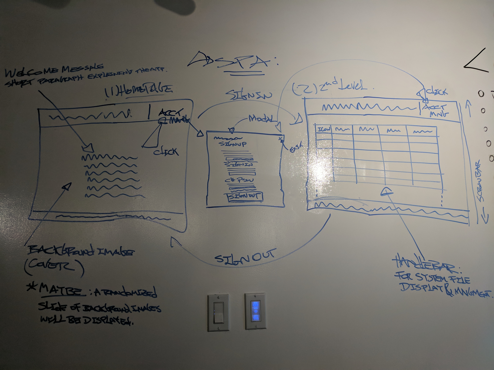

# FileDumpling

###### FileDumpling is a simple web application to upload and download files. Users can upload files, which are hosted with Amazon Web Services' S3 Bucket, and download the files to their local computer. For each file added, metadata is stored, using a back end application. Users can edit information about the files they upload themselves, but not for files upload by other users.

---

### Links:

Back End Repo: https://github.com/4KnClone/FileDumpling-Back-End
Deployed Back End: https://enigmatic-beach-10306.herokuapp.com/
Deployed Front End: https://4knclone.github.io/FileDumpling/

### Technologies Used:
  -HTML
  -CSS (Sass)
  -JavaScript
  -jQuery
  -AJAX
  -Handlebars
  -Bootstrap

### Original User Stories:
  A user can sign up to create an account.
  A user can sign into their account.
  A user can change their password.
  A user can sign out of their account.
  A user can upload files of many different MIME types.
  A user can edit the tags, the name of their files.
  A user can delete their files.
  Another user can view another user's files and download it.
  Another user cannot edit or delete other user's files.
  A user cannot change the file's owner.
  A user can add tags to the file.

### Wireframe

### Project Planning Process:

Our team utilized elements from Scrum framework during the project planning process, including a daily standup and end of day review. During the end of day review, we delegated tasks to complete during the evening, while in the morning standup, we would review the evening commits and begin to merge the changes.

#### Day 1:

On the first day, our group began by building out the wireframe, user stories, and the ERD. This was extremely useful in terms of getting the entire team on the same page before we even started to code. We decided to set up the front and back end templates as a team, as well as deploying both our front and back end applications.

Once we had set up both of our repositories, we split the team into two pair-programming groups, trying as much as possible to work on tasks that do not iterate off of one another. By doing this, we were able to build out much of the important infrastructure of the project in a way that minimized merge conflicts. By the end of day 1, our group had build a working skeleton of our app's back end.

#### Day 2:

On the second day, our group split up tasks to build out the front end, and integrate a simple upload form with our API. We focused heavily on first meeting the basic requirements for the project, so we put a greater priority on implementing create, read, update, and destroy functions for a user's uploads.

This day was also a good learning experience for our teamwork and problem solving. We spent a signficant amount of time as a group dealing with merge conflicts, as well as Heroku deployment issues. While each one of us had different ideas for how to resolve issues when they came up, we alternated who would lead during this period of error-driven development.

#### Day 3:

On the third day, our group focused on user interface and user experience. A majority of the efforts went into adding in functionality and messaging that improves the overall UX.

Team 4KnClone: Aaron Vale, Matthew Goldman, Katherine Wu, Vitorio Paulo

#### Future Possible Additions

Other features we discussed implementing are a simple permissions system, that would allow multiple users to collaborate on a document, different button and form stylings, as well as the ability to delete files from the AWS bucket as well as the Mongo database.
